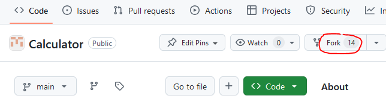
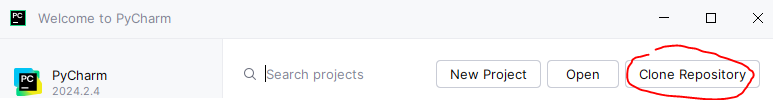
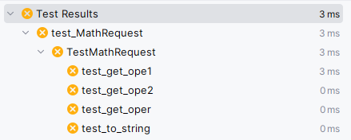
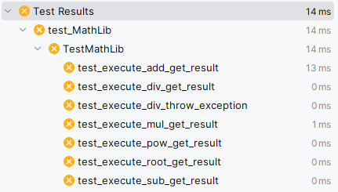
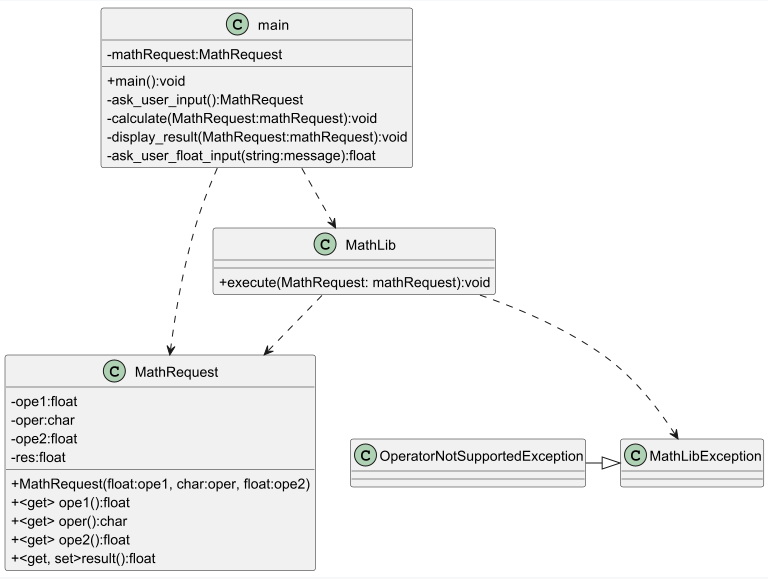

# Calculator

Ce dépôt a été créé à des fins pédagogiques. Il permet de s'entraîner à l'utilisation de git-flow tout comme de s'initier à la programmation orientée objet.

---

## Comment débuter le travail

1. Réaliser un fork de ce dépôt afin de disposer d'une copie de ce projet



2. Récupérer le projet en local à l'aide d'une opération de "clone"

* en ligne de commande

```git
git clone <url de votre dépôt forké>
```

* via l'interface graphique de votre IDE



3. Exécuter les tests

* Résultat obtenu pour test_MathRequest



* Résultat obtenu pour test_MathLib



3. Etudier l'architecture du code



* Identifiez bien les différentes classes ainsi que leur relations.

---

## Backlog

Tentez de faire passer un maximum de tests !

Le "main" ne fait pas parti du livrable attendu.

---

## Evaluation

Les critères suivants sont pris en compte:

* Les principes SRP sont suivis.
* Les classes de testes n'ont pas été modifiées.
* Les classes d'implémentations respectent les normes PEP 8.
* Le code est fonctionnel.
* Un maximum de tests est validé.

Note :
Commentez les lignes de codes qui empêche l'exécution des tests, mais ne supprimez pas le code.

---

## Livraison

!! Vous ne publiez aucun contenu durant l'examen !!

Vous livrerez une fois le temps à disposition écoulé.

* Sur la branche "develop"
* Directement sur votre dépôt.

```git
git push

ou si c'est la première fois que vous livrez sur une branche qui n'existe pas encore sur votre dépôt

git push --set-upstream <repository> <branchname>
```

## Aides

* Initier Git-flow et ainsi disposer de la branche develop

```git
git flow init    
```

* Vérifer que vous avez bien "clone" votre dépôt, et non celui de l'enseignant

```
   git remote -v
```

* Créer une branche

```git
git flow feature start <Nom de votre branche>
```

* Se déplacer d'une branche à l'autre

```git
git switch <Nom de la branche de destination>
```

* Terminer une branche (et l'intégrer dans develop)

Note : placez-vous sur la branche à terminer

```git
git flow feature finish
```